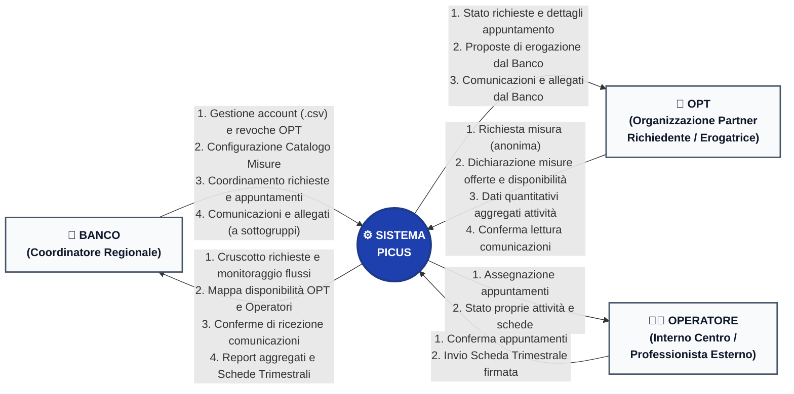

```mermaid
flowchart LR
    %% Stili
    classDef system fill:#1e40af,stroke:#1e3a8a,stroke-width:3px,color:#fff,font-weight:bold;
    classDef actor fill:#f8fafc,stroke:#475569,stroke-width:2px,color:#0f172a,font-weight:bold;

    %% Nodi
    BANCO["🏢 BANCO<br/>(Coordinatore Regionale)"]:::actor
    PICUS(("⚙️ SISTEMA<br/>PICUS")):::system
    OPT["📱 OPT<br/>(Organizzazione Partner<br/>Richiedente / Erogatrice)"]:::actor
    OP["🧑‍⚕️ OPERATORE<br/>(Interno Centro /<br/>Professionista Esterno)"]:::actor

    %% Flussi Banco <-> PICUS
    BANCO -- "1. Gestione account (.csv) e revoche OPT<br/>2. Configurazione Catalogo Misure<br/>3. Coordinamento richieste e appuntamenti<br/>4. Comunicazioni e allegati (a sottogruppi)" --> PICUS
    PICUS -- "1. Cruscotto richieste e monitoraggio flussi<br/>2. Mappa disponibilità OPT e Operatori<br/>3. Conferme di ricezione comunicazioni<br/>4. Report aggregati e Schede Trimestrali" --> BANCO

    %% Flussi OPT <-> PICUS
    OPT -- "1. Richiesta misura (anonima)<br/>2. Dichiarazione misure offerte e disponibilità<br/>3. Dati quantitativi aggregati attività<br/>4. Conferma lettura comunicazioni" --> PICUS
    PICUS -- "1. Stato richieste e dettagli appuntamento<br/>2. Proposte di erogazione dal Banco<br/>3. Comunicazioni e allegati dal Banco" --> OPT

    %% Flussi Operatore <-> PICUS
    OP -- "1. Conferma appuntamenti<br/>2. Invio Scheda Trimestrale firmata" --> PICUS
    PICUS -- "1. Assegnazione appuntamenti<br/>2. Stato proprie attività e schede" --> OP
```